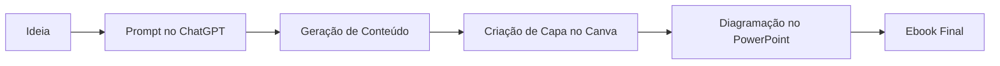

# 📚 Projeto EBOOK Gerado por I.A.s

<p align="center">
  
  
  
  
</p>

---

## 🚀 Sobre o Projeto

> ℹ️ **NOTE:** Este repositório foi desenvolvido durante o curso em que atuei como instrutor técnico na plataforma DIO.

Este projeto tem como objetivo demonstrar como utilizar ferramentas de Inteligência Artificial para criar um ebook digital de forma eficiente, desde a geração de conteúdo até a diagramação final.

Aqui você encontrará todos os prompts utilizados, além das instruções necessárias para replicar o processo.

---

## 📕 Preview do Ebook

<p align="center">
  
</p>

<p align="center">
  🔗 <strong><a href="https://www.amazon.com.br/dp/B0GZ5LS2QF" target="_blank">Clique aqui para acessar o ebook completo</a></strong>
</p>

---

## 🧰 Tecnologias Utilizadas

<div align="center">

| Ferramenta    | Descrição                               |
| ------------- | --------------------------------------- |
| 🤖 ChatGPT    | Geração de conteúdo e estrutura textual |
| 🎨 Canva      | Criação da capa do ebook                |
| 📊 PowerPoint | Diagramação e design final              |

</div>

---

## 🧠 Engenharia de Prompts

### 📌 Geração de Título

```
Crie um título de um ebook sobre o tema [xxxx], o ebook é do nicho de [xxxx] e o subnicho é [xxxx]. 
O título deve ser épico e curto, com uma temática mais [xxxx], e liste 5 variações.
```

---

### 📌 Geração de Conteúdo

```
Faça um texto para o ebook, com foco em [xxxx], listando os principais [xxxx] com exemplos em [xxxx].
```

#### 🔧 Regras aplicadas:

* Explicação simples e didática
* Texto direto e enxuto
* Exemplos em contextos reais
* Títulos atrativos por seção

---

## 🎨 Processo Criativo



---

## 📚 Diretrizes de Design (PowerPoint)

* Tipografia escalável: **8px | 16px | 32px | 40px**
* Uso mínimo de texto por slide
* Layout limpo e visualmente agradável
* Hierarquia visual bem definida

---

## 🛠️ Como Reproduzir o Projeto

1. Utilize os prompts fornecidos no ChatGPT
2. Gere o conteúdo base do ebook
3. Crie a capa no Canva
4. Faça a diagramação no PowerPoint
5. Exporte o material final em PDF

---

## 🎥 Demonstração (Opcional)

<p align="center">
  
</p>

---

## 👨‍💻 Autor

<p align="center">
  <strong>Ricardo Freitas</strong><br><br>
  <a href="#">🔗 GitHub</a> •
  <a href="#">💼 LinkedIn</a> •
  <a href="#">📸 Instagram</a>
</p>

---

## ⭐ Contribuição

Se este projeto te ajudou de alguma forma, considere deixar uma ⭐ no repositório!

---

## 📌 Observação Final

Este projeto demonstra como a combinação entre **criatividade + IA + boas práticas de design** pode acelerar significativamente a produção de conteúdos digitais de alta qualidade.

---
